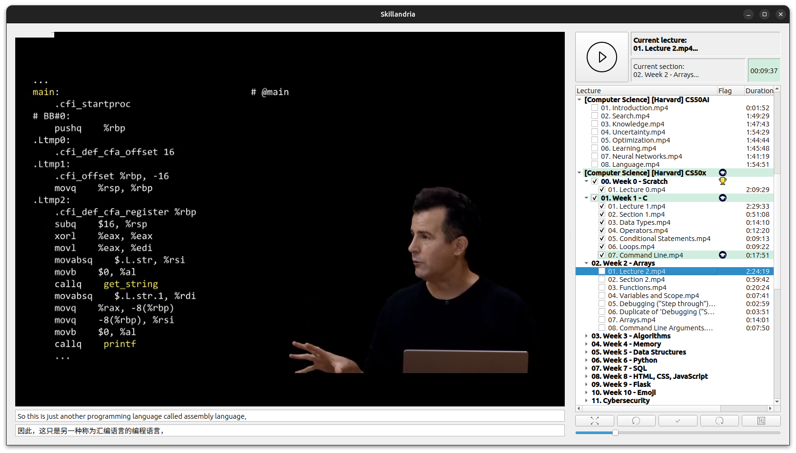

# Skillandria

Skillandria is a small desktop application to manage and play offline video tutorials and courses. 
It's not aiming to be rich on features but to allow a clean environment to focus on learning while tracking the progress. 

It's witten in Python 3 and QT.

## Features
 - Recursive scanning and smart sorting
 - Subtitle support with automatic real time translation to several languages (.srt files)
 - Tracking of time spent per lecture
 - Bookmarks with annotations
 - Visual indicators for last session and lectures finished  
 - Auto resume, kiosk mode, light and dark themes
 - Speeding up / down controls

## Usage
 - Root folder containing the courses must be specified by the user on the first run clicking on the folder icon 
 - The application will look for lectures, sorting them in a tree view
 - Navigation is done by single clicking, lectures are played using the play button only
 - Timer tracks how much the user spent on every lecture (even paused, this is an intended behaviour)
 - Book icon = last lecture, check mark = lecture finished, laurel wreath icon = whole section finished
 - Bookmarks can be added by clicking on the star icon, reason can be specified using the dropbox

## To Do
 - Better velocity management (avoid audio pitching)

## License
Skillandria is written by P. Cervantes and licensed as Free Software under the GNU General Public License 
