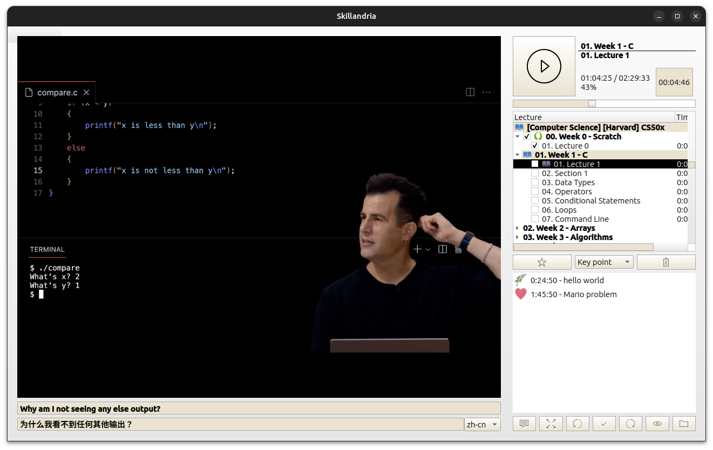

# Skillandria

Skillandria is a small desktop application to manage and play offline video tutorials and courses. 
It's not aiming to be rich on features but to allow a clean environment to focus on learning while tracking the progress. 

It's witten in Python 3 and QT.

## Features
 - Recursive scanning and smart sorting
 - Subtitle support with automatic real time translation to several languages (.srt files)
 - Tracking of time spent per lecture
 - Visual indicators for last session and lectures finished  
 - Auto resume, kiosk mode, light and dark themes
 - Speeding up / down controls

## Usage
 - On the first run, user must specify the folder containing courses and the language for subtitle translation
 - The application will look for lectures, sorting them in a tree view
 - Navigation is done with a single click and video only starts / pauses through the big play button
 - Timer tracks how much the user spent on every lecture (even paused, this is an intended behaviour)
 - Graduation cap icon points to the last lecture from the last session, a checkmark appears next to finished lectures

## To Do
 - Bookmarks with annotations
 - Better velocity management (avoid audio pitching)

## License
Skillandria is Free Software under the GNU General Public License 